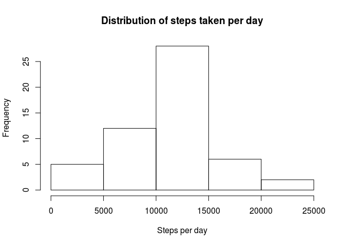
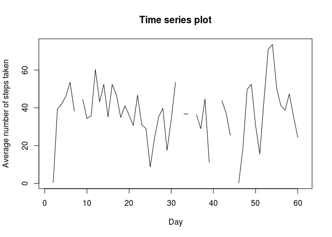
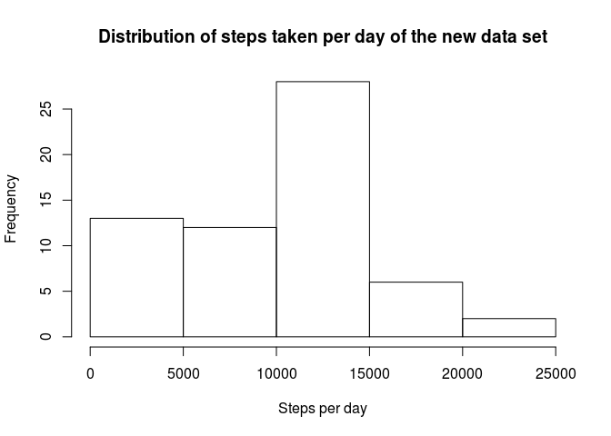
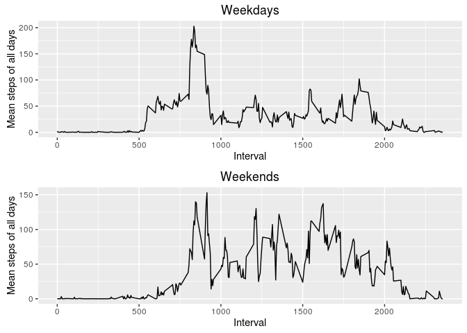

# Reproducible Research: Peer Assessment 1


## Loading and preprocessing the data

```r
myData <- read.csv("activity.csv")
str(myData)
```

```
## 'data.frame':	17568 obs. of  3 variables:
##  $ steps   : int  NA NA NA NA NA NA NA NA NA NA ...
##  $ date    : Factor w/ 61 levels "2012-10-01","2012-10-02",..: 1 1 1 1 1 1 1 1 1 1 ...
##  $ interval: int  0 5 10 15 20 25 30 35 40 45 ...
```
## What is mean total number of steps taken per day?
####1.) Calculating the total number of steps taken per day:

```r
steps_per_day <- ddply(myData, .(date), summarize, totalSteps = as.numeric(sum(steps)))
#steps_per_day
```

####2.) Histogram of the total number of steps taken each day:

```r
hist(steps_per_day$totalSteps,xlab = "Steps per day", ylab = "Frequency",main = "Distribution of steps taken per day")
```

<!-- -->

####3.) Calculating mean and median of the total number of steps taken per day:

```r
mean_steps_per_day <- ddply(myData, .(date), summarize, meanSteps = round(as.numeric(mean(steps)),2))
median_steps_per_day <- ddply(myData, .(date), summarize, medianSteps = round(as.numeric(median(steps)),2))

nRows=1:nrow(mean_steps_per_day)

initialFlag<-0
for(i in nRows+1){ 
  X<-paste(i-1,"\t",mean_steps_per_day$date[i-1],"\t",mean_steps_per_day$meanSteps[i-1],"\t\t\t\t",median_steps_per_day$medianSteps[i-1],"\n")
  
  if(initialFlag ==0 ){
      cat("Day\t","Date\t\t\t","Mean steps per day\t","Median steps per day\n")
      initialFlag <- 99
      cat(X)
  }
  else
      cat(X)
}
```

```
## Day	 Date			 Mean steps per day	 Median steps per day
## 1 	 2012-10-01 	 NA 				 NA 
## 2 	 2012-10-02 	 0.44 				 0 
## 3 	 2012-10-03 	 39.42 				 0 
## 4 	 2012-10-04 	 42.07 				 0 
## 5 	 2012-10-05 	 46.16 				 0 
## 6 	 2012-10-06 	 53.54 				 0 
## 7 	 2012-10-07 	 38.25 				 0 
## 8 	 2012-10-08 	 NA 				 NA 
## 9 	 2012-10-09 	 44.48 				 0 
## 10 	 2012-10-10 	 34.38 				 0 
## 11 	 2012-10-11 	 35.78 				 0 
## 12 	 2012-10-12 	 60.35 				 0 
## 13 	 2012-10-13 	 43.15 				 0 
## 14 	 2012-10-14 	 52.42 				 0 
## 15 	 2012-10-15 	 35.2 				 0 
## 16 	 2012-10-16 	 52.38 				 0 
## 17 	 2012-10-17 	 46.71 				 0 
## 18 	 2012-10-18 	 34.92 				 0 
## 19 	 2012-10-19 	 41.07 				 0 
## 20 	 2012-10-20 	 36.09 				 0 
## 21 	 2012-10-21 	 30.63 				 0 
## 22 	 2012-10-22 	 46.74 				 0 
## 23 	 2012-10-23 	 30.97 				 0 
## 24 	 2012-10-24 	 29.01 				 0 
## 25 	 2012-10-25 	 8.65 				 0 
## 26 	 2012-10-26 	 23.53 				 0 
## 27 	 2012-10-27 	 35.14 				 0 
## 28 	 2012-10-28 	 39.78 				 0 
## 29 	 2012-10-29 	 17.42 				 0 
## 30 	 2012-10-30 	 34.09 				 0 
## 31 	 2012-10-31 	 53.52 				 0 
## 32 	 2012-11-01 	 NA 				 NA 
## 33 	 2012-11-02 	 36.81 				 0 
## 34 	 2012-11-03 	 36.7 				 0 
## 35 	 2012-11-04 	 NA 				 NA 
## 36 	 2012-11-05 	 36.25 				 0 
## 37 	 2012-11-06 	 28.94 				 0 
## 38 	 2012-11-07 	 44.73 				 0 
## 39 	 2012-11-08 	 11.18 				 0 
## 40 	 2012-11-09 	 NA 				 NA 
## 41 	 2012-11-10 	 NA 				 NA 
## 42 	 2012-11-11 	 43.78 				 0 
## 43 	 2012-11-12 	 37.38 				 0 
## 44 	 2012-11-13 	 25.47 				 0 
## 45 	 2012-11-14 	 NA 				 NA 
## 46 	 2012-11-15 	 0.14 				 0 
## 47 	 2012-11-16 	 18.89 				 0 
## 48 	 2012-11-17 	 49.79 				 0 
## 49 	 2012-11-18 	 52.47 				 0 
## 50 	 2012-11-19 	 30.7 				 0 
## 51 	 2012-11-20 	 15.53 				 0 
## 52 	 2012-11-21 	 44.4 				 0 
## 53 	 2012-11-22 	 70.93 				 0 
## 54 	 2012-11-23 	 73.59 				 0 
## 55 	 2012-11-24 	 50.27 				 0 
## 56 	 2012-11-25 	 41.09 				 0 
## 57 	 2012-11-26 	 38.76 				 0 
## 58 	 2012-11-27 	 47.38 				 0 
## 59 	 2012-11-28 	 35.36 				 0 
## 60 	 2012-11-29 	 24.47 				 0 
## 61 	 2012-11-30 	 NA 				 NA
```

## What is the average daily activity pattern?
####1.) Time series plot of the 5-minute interval (x-axis) and the average number of steps taken, averaged across all days (y-axis)

```r
plot(mean_steps_per_day$meanSteps,type="l",xlab = "Day", ylab = "Average number of steps taken",main = "Time series plot")
```

<!-- -->

Note that the missing points are seen as missing points/lines in the above plot.

####2.) Which 5-minute interval, on average across all the days in the dataset, contains the maximum number of steps?
Day 53 (2012-11-23) has the maximum average which is 73.59.

## Imputing missing values
####1.) Calculate and report the total number of missing values in the dataset (i.e. the total number of rows with NAs)

```r
nRows=1:nrow(myData)

NACounter<-sum(is.na(myData$steps))
cat("Number of missing values in the dataset: ",NACounter)
```

```
## Number of missing values in the dataset:  2304
```

####2.) Devise a strategy for filling in all of the missing values in the dataset. The strategy does not need to be sophisticated. For example, you could use the mean/median for that day, or the mean for that 5-minute interval, etc.

Here I will replace the NAs with 0 to represent "no activity performed".

####3.) Create a new dataset that is equal to the original dataset but with the missing data filled in.

```r
myNewData <- myData
myNewData[is.na(myNewData)] <- 0
```

####4.) Make a histogram of the total number of steps taken each day and Calculate and report the mean and median total number of steps taken per day. Do these values differ from the estimates from the first part of the assignment? What is the impact of imputing missing data on the estimates of the total daily number of steps?


```r
steps_per_day <- ddply(myNewData, .(date), summarize, totalSteps = as.numeric(sum(steps)))
hist(steps_per_day$totalSteps,xlab = "Steps per day", ylab = "Frequency",main = "Distribution of steps taken per day of the new data set")
```

<!-- -->

```r
mean_steps_per_day <- ddply(myNewData, .(date), summarize, meanSteps = round(as.numeric(mean(steps)),2))
median_steps_per_day <- ddply(myNewData, .(date), summarize, medianSteps = round(as.numeric(median(steps)),2))

nRows=1:nrow(mean_steps_per_day)

initialFlag<-0
for(i in nRows+1){
  X<-paste(i-1,"\t",mean_steps_per_day$date[i-1],"\t",mean_steps_per_day$meanSteps[i-1],"\t\t\t\t\t\t\t\t\t\t",median_steps_per_day$medianSteps[i-1],"\n")
  if(initialFlag == 0){
      cat("Day\t","Date\t\t\t","Mean steps per day for the new dataset\t","Median steps per day for the new dataset\n")
      initialFlag <- 99
      cat(X)
  }
  else
      cat(X)
}
```

```
## Day	 Date			 Mean steps per day for the new dataset	 Median steps per day for the new dataset
## 1 	 2012-10-01 	 0 										 0 
## 2 	 2012-10-02 	 0.44 										 0 
## 3 	 2012-10-03 	 39.42 										 0 
## 4 	 2012-10-04 	 42.07 										 0 
## 5 	 2012-10-05 	 46.16 										 0 
## 6 	 2012-10-06 	 53.54 										 0 
## 7 	 2012-10-07 	 38.25 										 0 
## 8 	 2012-10-08 	 0 										 0 
## 9 	 2012-10-09 	 44.48 										 0 
## 10 	 2012-10-10 	 34.38 										 0 
## 11 	 2012-10-11 	 35.78 										 0 
## 12 	 2012-10-12 	 60.35 										 0 
## 13 	 2012-10-13 	 43.15 										 0 
## 14 	 2012-10-14 	 52.42 										 0 
## 15 	 2012-10-15 	 35.2 										 0 
## 16 	 2012-10-16 	 52.38 										 0 
## 17 	 2012-10-17 	 46.71 										 0 
## 18 	 2012-10-18 	 34.92 										 0 
## 19 	 2012-10-19 	 41.07 										 0 
## 20 	 2012-10-20 	 36.09 										 0 
## 21 	 2012-10-21 	 30.63 										 0 
## 22 	 2012-10-22 	 46.74 										 0 
## 23 	 2012-10-23 	 30.97 										 0 
## 24 	 2012-10-24 	 29.01 										 0 
## 25 	 2012-10-25 	 8.65 										 0 
## 26 	 2012-10-26 	 23.53 										 0 
## 27 	 2012-10-27 	 35.14 										 0 
## 28 	 2012-10-28 	 39.78 										 0 
## 29 	 2012-10-29 	 17.42 										 0 
## 30 	 2012-10-30 	 34.09 										 0 
## 31 	 2012-10-31 	 53.52 										 0 
## 32 	 2012-11-01 	 0 										 0 
## 33 	 2012-11-02 	 36.81 										 0 
## 34 	 2012-11-03 	 36.7 										 0 
## 35 	 2012-11-04 	 0 										 0 
## 36 	 2012-11-05 	 36.25 										 0 
## 37 	 2012-11-06 	 28.94 										 0 
## 38 	 2012-11-07 	 44.73 										 0 
## 39 	 2012-11-08 	 11.18 										 0 
## 40 	 2012-11-09 	 0 										 0 
## 41 	 2012-11-10 	 0 										 0 
## 42 	 2012-11-11 	 43.78 										 0 
## 43 	 2012-11-12 	 37.38 										 0 
## 44 	 2012-11-13 	 25.47 										 0 
## 45 	 2012-11-14 	 0 										 0 
## 46 	 2012-11-15 	 0.14 										 0 
## 47 	 2012-11-16 	 18.89 										 0 
## 48 	 2012-11-17 	 49.79 										 0 
## 49 	 2012-11-18 	 52.47 										 0 
## 50 	 2012-11-19 	 30.7 										 0 
## 51 	 2012-11-20 	 15.53 										 0 
## 52 	 2012-11-21 	 44.4 										 0 
## 53 	 2012-11-22 	 70.93 										 0 
## 54 	 2012-11-23 	 73.59 										 0 
## 55 	 2012-11-24 	 50.27 										 0 
## 56 	 2012-11-25 	 41.09 										 0 
## 57 	 2012-11-26 	 38.76 										 0 
## 58 	 2012-11-27 	 47.38 										 0 
## 59 	 2012-11-28 	 35.36 										 0 
## 60 	 2012-11-29 	 24.47 										 0 
## 61 	 2012-11-30 	 0 										 0
```
The impact of imputing NAs with 0 changed the skewness of the histogram in its lower tail representing more no-activity data.

## Are there differences in activity patterns between weekdays and weekends?
For this part the weekdays() function may be of some help here. Use the dataset with the filled-in missing values for this part.

1.) Create a new factor variable in the dataset with two levels – “weekday” and “weekend” indicating whether a given date is a weekday or weekend day.

```r
myNewData$date <- as.Date((myNewData$date))
myWeekdays <- c('måndag','tisdag','onsdag','torsdag','fredag')
#Use `%in%` and `weekdays` to create a logical vector
#convert to `factor` and specify the `levels/labels`
myNewData$dayType <- factor((weekdays(myNewData$date) %in% myWeekdays), levels=c(FALSE, TRUE), labels=c('weekend', 'weekday'))
summary(myNewData$dayType)
```

```
## weekend weekday 
##    4608   12960
```

2.) Make a panel plot containing a time series plot (i.e. type = "l") of the 5-minute interval (x-axis) and the average number of steps taken, averaged across all weekday days or weekend days (y-axis).


```r
myWeekends <- subset(myNewData,dayType=='weekend')
myWeekdays <- subset(myNewData,dayType=='weekday')

#splitting df w.r.t date to create data frames of each day separately
myWeekends_split<-split(myWeekends, as.Date(myWeekends$date))
myWeekdays_split<-split(myWeekdays, as.Date(myWeekdays$date))

#merging weekends and extracting steps and intervals to compute mean steps
merged_dF_weekends=rbind(myWeekends_split)
weekendsDF<-(sapply(merged_dF_weekends, function(x){x[1]}))
intervals<-(sapply(merged_dF_weekends, function(x){x[3]}))
weekendsDF<-do.call(cbind,weekendsDF)
weekendsDF<-rowMeans(weekendsDF)
weekendsDF<-cbind(weekendsDF,intervals[1]$interval)
weekendsDF<-data.frame(weekendsDF)
colnames(weekendsDF)<- c("weekends","interval")

#merging weekdays and extracting steps and intervals to compute mean steps
merged_dF_weekdays=rbind(myWeekdays_split)
weekdaysDF<-(sapply(merged_dF_weekdays, function(x){x[1]}))
intervals<-(sapply(merged_dF_weekdays, function(x){x[3]}))
weekdaysDF<-do.call(cbind,weekdaysDF)
weekdaysDF<-rowMeans(weekdaysDF)
weekdaysDF<-cbind(weekdaysDF,intervals[1]$interval)
weekdaysDF<-data.frame(weekdaysDF)
colnames(weekdaysDF)<- c("weekdays","interval")

merged_dF <- merge(weekendsDF, weekdaysDF, by = "interval")

require(gridExtra)
```

```
## Loading required package: gridExtra
```

```r
plot1<-qplot(interval, weekdays, data = merged_dF,geom = c("line"),xlab = "Interval",ylab="Mean steps of all days",main="Weekdays")
plot2<-qplot(interval, weekends, data = merged_dF,geom = c("line"),xlab = "Interval",ylab="Mean steps of all days",main="Weekends")
grid.arrange(plot1, plot2, nrow=2)
```

<!-- -->
